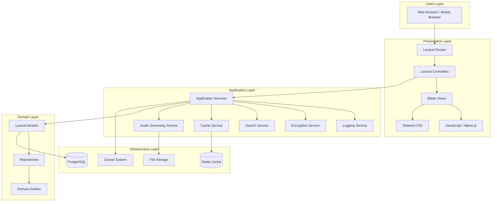
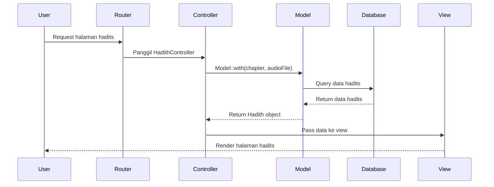
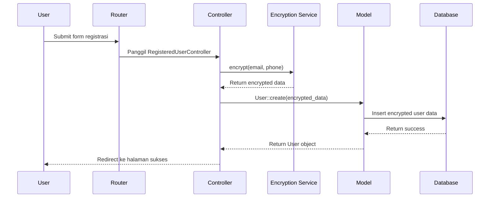
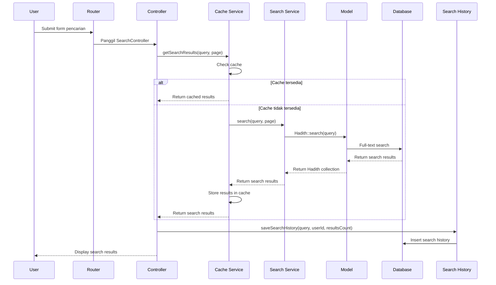
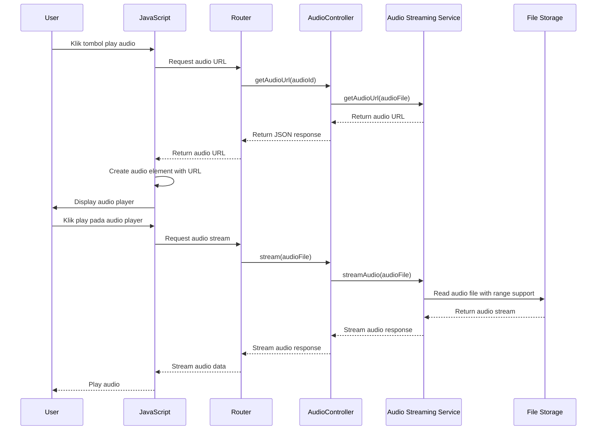
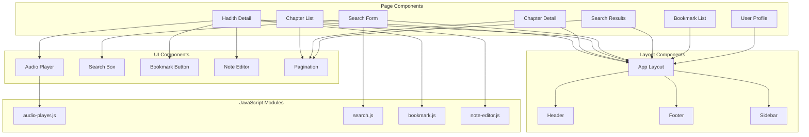
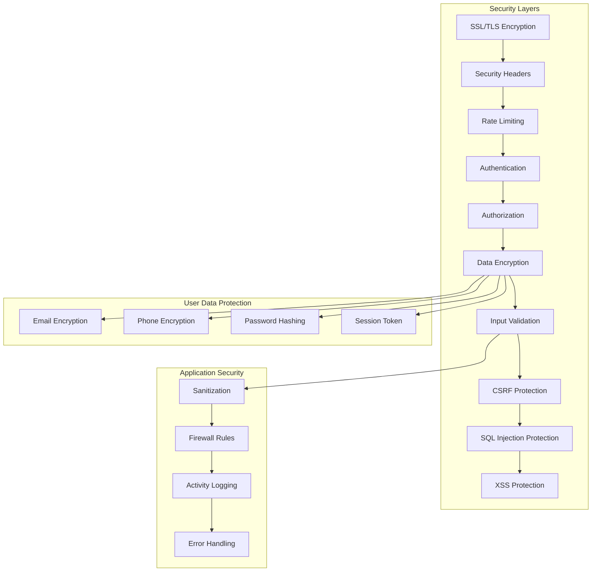
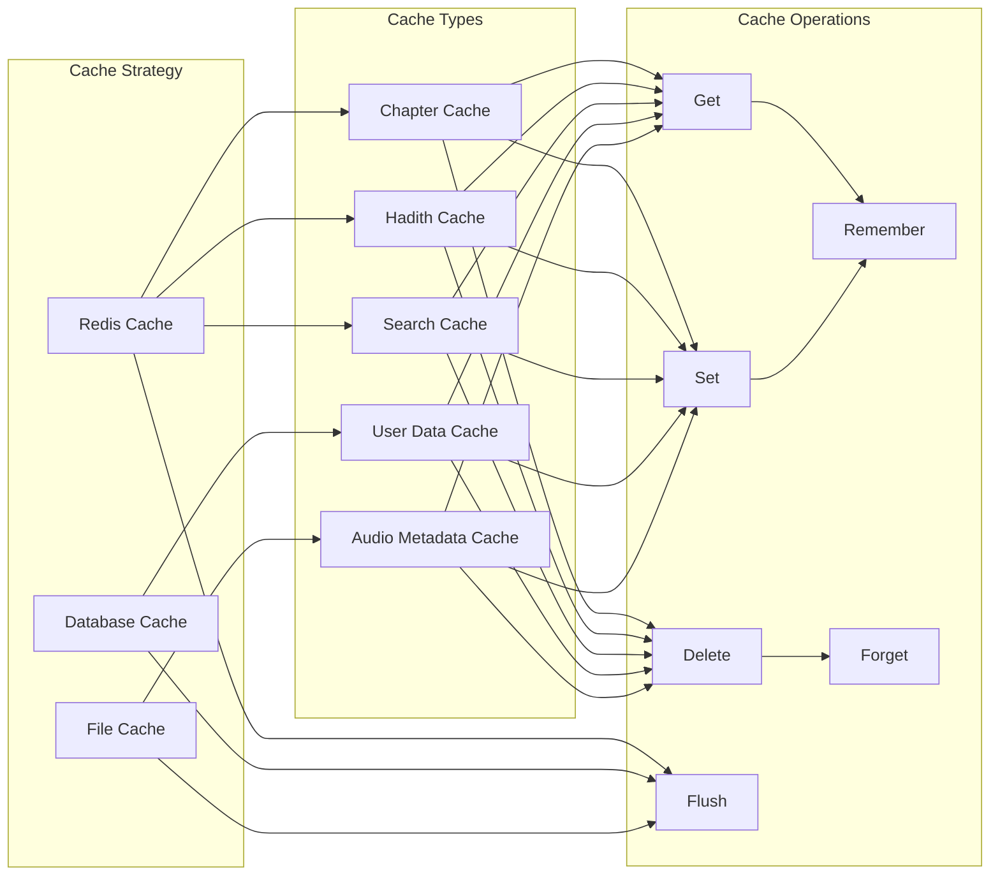

# Diagram Arsitektur Sistem Aplikasi Buku Syamail Muhammadiyah

## 1. Arsitektur Sistem secara Keseluruhan



## 2. Arsitektur Database

```mermaid
erDiagram
    users ||--o{ bookmarks : has
    users ||--o{ user_notes : has
    users ||--o{ search_history : has
    chapters ||--o{ hadiths : contains
    hadiths ||--o| audio_files : has
    hadiths ||--o{ bookmarks : has
    hadiths ||--o{ user_notes : has
    
    users {
        bigint id PK
        string name
        string encrypted_email
        string encrypted_phone
        string hashed_password
        timestamp email_verified_at
        string remember_token
        timestamps
    }
    
    chapters {
        bigserial id PK
        string title
        text description
        integer chapter_number
        timestamps
    }
    
    hadiths {
        bigserial id PK
        bigint chapter_id FK
        text arabic_text
        text translation
        text interpretation
        string narration_source
        integer hadith_number
        timestamps
    }
    
    audio_files {
        bigserial id PK
        bigint hadith_id FK
        string file_path
        interval duration
        bigint file_size
        timestamps
    }
    
    bookmarks {
        bigserial id PK
        bigint user_id FK
        bigint hadith_id FK
        text notes
        timestamps
    }
    
    user_notes {
        bigserial id PK
        bigint user_id FK
        bigint hadith_id FK
        text note_content
        timestamps
    }
    
    search_history {
        bigserial id PK
        bigint user_id FK
        string query
        integer results_count
        timestamps
    }
```

## 3. Alur Data untuk Fitur Utama

### 3.1 Alur Data untuk Menampilkan Hadits



### 3.2 Alur Data untuk Enkripsi Data Pengguna



### 3.3 Alur Data untuk Pencarian Hadits



### 3.4 Alur Data untuk Streaming Audio dengan Lazy Loading



## 4. Arsitektur Komponen Frontend



## 5. Arsitektur Keamanan



## 6. Arsitektur Caching



## 7. Deployment Architecture

```mermaid
graph TB
    subgraph "Production Environment"
        subgraph "Web Server"
            NG[Nginx]
            LS[Laravel]
        end
        
        subgraph "Application Server"
            PM[PHP-FPM]
            SC[Supervisor]
        end
        
        subgraph "Database Server"
            PG2[(PostgreSQL)]
            RD2[(Redis)]
        end
        
        subgraph "File Storage"
            S3[Amazon S3 / Local Storage]
        end
        
        subgraph "Monitoring"
            MON[Monitoring Tools]
            LOG[Logging System]
        end
    end
    
    subgraph "CDN"
        CDN[Content Delivery Network]
    end
    
    subgraph "DNS"
        DNS[DNS Management]
    end
    
    DNS --> NG
    NG --> PM
    PM --> LS
    LS --> PG2
    LS --> RD2
    LS --> S3
    SC --> LS
    MON --> NG
    MON --> PM
    MON --> PG2
    MON --> RD2
    LOG --> LS
    LOG --> PM
    LOG --> PG2
    S3 --> CDN
```

## 8. Microservices Architecture (Future Enhancement)

```mermaid
graph TB
    subgraph "API Gateway"
        GW[API Gateway]
    end
    
    subgraph "User Service"
        US[User Service]
        UDB[(User DB)]
    end
    
    subgraph "Content Service"
        CS[Content Service]
        CDB[(Content DB)]
    end
    
    subgraph "Search Service"
        SS[Search Service]
        SE[Search Engine]
    end
    
    subgraph "Audio Service"
        AS[Audio Service]
        ADB[(Audio DB)]
        FS2[File Storage]
    end
    
    subgraph "Notification Service"
        NS[Notification Service]
    end
    
    GW --> US
    GW --> CS
    GW --> SS
    GW --> AS
    GW --> NS
    
    US --> UDB
    CS --> CDB
    SS --> SE
    AS --> ADB
    AS --> FS2